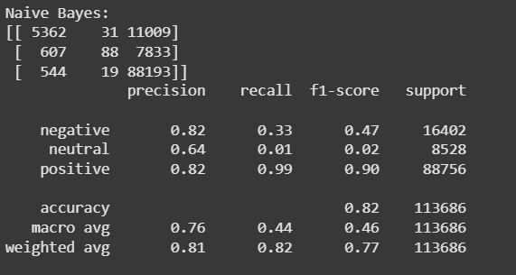
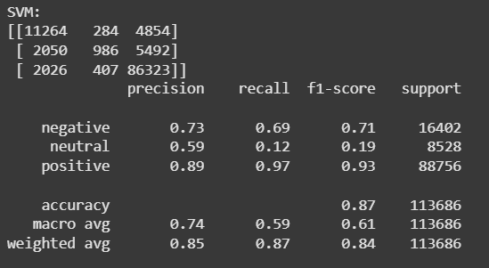

# 🧠 Review Dish: NLP-Powered Customer Review Analysis System

A complete Natural Language Processing (NLP) pipeline to analyze large-scale customer reviews and comments. This capstone project extracts insights, classifies sentiment, identifies key topics and trends, and recommends business strategies through a rich set of visualizations and machine learning models.

---

## 📌 Table of Contents

- [Overview](#overview)
- [Objectives](#objectives)
- [Tech Stack](#tech-stack)
- [Project Pipeline](#project-pipeline)
- [Dataset](#dataset)
- [Screenshots](#screenshots)
- [Future Work](#future-work)

---

## 📖 Overview

This project leverages NLP techniques and machine learning models to analyze text reviews from customers. It transforms unstructured review data into actionable business insights through sentiment classification, topic modeling, trend analysis, and interactive dashboards.

---

## 🎯 Objectives

- Understand **customer sentiment** across reviews
- Identify **frequently mentioned topics and keywords**
- Classify reviews by **sentiment and intent**
- Recommend data-driven **business improvements**
- Provide **visual reports** through interactive dashboards

---

## 🧰 Tech Stack

| Component          | Tool/Library                   |
|-------------------|--------------------------------|
| Language           | Python                         |
| Notebook           | Google Colab / Jupyter         |
| NLP Libraries      | NLTK, spaCy, TextBlob, BERTopic|
| Vectorization      | TF-IDF, Word2Vec, BERT         |
| ML Models          | Logistic Regression, SVM, Naive Bayes |
| Topic Modeling     | BERTopic                  |
| Trend Analysis     | Pandas, Matplotlib, Seaborn    |
| Dashboards         | Plotly              |
| NER                | spaCy                          |

---

## 📈 Project Pipeline

### ✅ 1. Data Preprocessing

- Removed noise (HTML, symbols)
- Lowercased, tokenized, and lemmatized
- Vectorized using TF-IDF, Word2Vec, and BERT

### ✅ 2. Exploratory Text Analysis

- Word clouds by sentiment class  
- N-gram frequency analysis  
- Ratings by product & time period

### ✅ 3. Sentiment Classification

- Trained models: Logistic Regression, Naive Bayes, SVM  
- Evaluated with Confusion Matrix, Precision, Recall, F1-Score

### ✅ 4. Topic Modeling

- BERTopic to extract major discussion points  
- Topics mapped to high/low ratings  

### ✅ 5. Trend Analysis

- Time-series plots of sentiment over months/years  
- Spike detection after product launches

### ✅ 6. Named Entity Recognition (NER)

- Used spaCy to extract entities: brands, places, product names

### ✅ 7. Insight Generation

- Identified common praise/complaints  
- Suggested strategic improvements

### ✅ 8. Reporting & Visualization

- Built interactive dashboard using Streamlit Plotly  

---

## 📂 Dataset

We used publicly available customer review datasets with:

- `text` – full customer review  
- `score` – star rating (1–5)  
- `time` – UNIX timestamp  
- `productId`, `userId`, etc. (optional)

📥 **Dataset Link**: [Amazon Fine Food Reviews (Kaggle)](https://www.kaggle.com/datasets/snap/amazon-fine-food-reviews)

💡 Used 568,454 samples for optimal results.

---

## 📸 Screenshots

> 📌 visuals

### 🔹 Word Clouds

### 🔹 Model Performance

### 🔹 Sentiment Over Time

### 🔹 BERTopic Clusters

---

## 🔭 Future Work

- Use multilingual datasets
- Integrate audio/video sentiment (AssemblyAI)
- Real-time dashboard updates
- Deploy full app with feedback API

---

